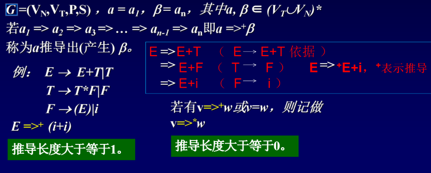
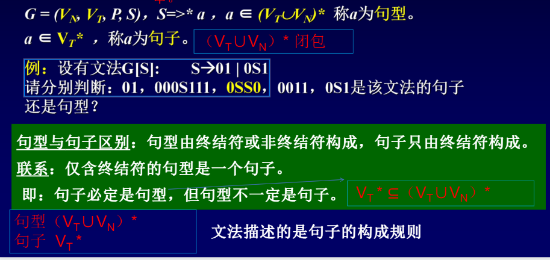

# 文法和语言

文法(上下文无关无法)G[<标识符>]：

​		<标识符> —> <字母>	(重写规则(产生式))

​		<标识符> —> <标识符><数字>

​		<标识符> —> <标识符><字母>

​		<字母> —> a|b|c|......|z

​		<数字> —> 0|1|2|....|9

元语言符号：—> 和 ::= 表示定义为 。“|”表示或者

文法G定义为四元组(Vn,Vt,P,S)

​	Vn 非终结符集		Vt 终结符集		P重写规则集合		S识别符号，S∈Vn

Vn 非终结符：在文法中的左部出现

Vt 终结符：只在右部位终结符

P 重写规则集合：就是用花括号括起来的就是重写规则的集合，就是终结符和非终结符的集合，称为重写规则集合。

S 识别符号：第一条规则的左部，就是识别符号。

`Vn={<标识符>,<字母>,<数字>}`	`Vt={a,b,c,...z,0,1,2.....9}`		`P={<标识符>—><字母>}`

.......

`{  <数字>—> 0|1|2|.....|9 }`

S=<标识符>

Vn∩Vt=∅			V=Vn∩Vt

很多时候，不用将文法G的四元组显示地表示出来，而只将产生式写出。一般约定，第一条产生式的左部是识别符；用尖括号括起来的是非终结符，不用尖括号括起来的是终结符，或者用大写字母表示非终结符，小写字母表示终结符。另外，也有一种习惯写法，将G写成G[S]，其中S是识别符，例还可以写成：

​		G：S —> 0S1

​			   S —> 01

​	或

​		G[S]:	 S —> 0S1

​					 S —>  01

# 符号和符号串

## 1、字母表：

元素的非空有限集，例：`∑={a、b、c}`

注意：

1. 字母表中至少包含一个元素
2. 字母表中的元素可以是字母、数字或其他符号
3. 在不同语言有不同的字母表
4. 任何语言的字母表指出了改语言中允许出现的一切符号

## 2、符号（字符）：

字母表中的元素成为符号。

例：字母表`∑={a、b、c}`中的a,b,c为符号

## 3、符号串：

符号串的有穷序列称为符号串。

例：字母表`∑={a、b、c}`，可组成的符号串有a,b,c,aa,ba,cba...

注意：

1. 符号串总是建立在某个特定字母表上的且只能由字母表上的有穷多个符号组成。

2. 符号串中符号的顺序是很重要的

3. 符号串的长度：符号串中所包含的符号的个数。

   例：s=lamstring，则|s|=9

4. 不包含任何符号的符号串，称为空符号串，用`ε`表示，即`|ε|`=0空串的长度为0

# 符号串的运算

1、符号串的连接

例：x=ab，y=vc，则xy=abvc

注意：对任意的符号串x，有x`ε`=`ε`x=x

如果和空串(`ε`)连接，都是它本身

2、符号串的幂运算

例：x=ab，则
$$
x^0=ε,x^1=ab,....
\\
x^2=abab
$$
3、集合的乘积

`AB={xy|x∈A且y∈B}`

例：`A={x,y,z} B={a,bc}`则AB=？

`{xya,xybc,za,zbc}`两个集合做乘积=集合

注意：

1. `ε`A=A`ε`=A
2. `{ε}`与`{}`的区别
3. `{ε}`表示由空符号串`ε`所组成的集合，`{ε}`基数是1，`{}`基数是0
4. `{}`表示空集合`Ф`

4、集合的幂运算

例：`A={x,y,z},`则
$$
A^0=\{ε\},A^1=A,A^2=AA,...
$$
5、集合A的正闭包
$$
A^+与闭包A^*
$$

$$
A^+=A^1∪A^2∪A^3∪...∪A^n...\\
A^*=A^0∪A^1∪A^2∪...∪A^n=\{ε\}∪A^+
$$

注意：
$$
A^*中一定要包含空符号串ε。
$$
特点：集合的元素任意组合，组成的串都在闭包里。

# 文法和语言的形式定义

规则也称产生式，它是一个符号与一个符号串的有序对`(A,β)`，通常写作A—>β

其中A是一个符号，β是符号串，—>表示定义为或生成

例：

A—>0

A—>1

A—>A0

A—>A1

一组规则规定了一个语言的语法结构。

# 文法的定义

文法是产生式的非空有穷集合，通常表示成四元组
$$
G=(V_n,V_T,P,S)。其中：
$$

1. Vn是产生式中非终结符的集合
2. Vt是产生式中终结符的集合。Vn∩Vt=`∅`
3. P是文法规则的集合
4. S是非终结符，称为文法的开始符号，它至少要在一条规则的左部出现。由他开始，识别出我们所定义的语言。

规则中的符号分为两类：终结符号和非终结符号。

非终结符是出现在规则左部，能派生出符号或符号串的那些符号。(非终结符`Vn={E,T,F}`)

终结符是不属于非终结符的那些符号，它是组成语言的基本符号，终结符意味着替换的终止，它是一个语言中不可再分的基本符号。(终结符`Vt={+，*，(,),i}`)

例：

E—>E+T

E—>T

T—>T*F

T—>F

F—>(E)

F—>i

约定：第一条规则的左部是文法开始的符号，对文法不用四元式显示表示，而只写规则集合。

1. 直接推导

   G=(Vn,Vt,P,S)，其中v=α，A，γ，w=a，β，γ，A∈N

   a，β，γ∈(Vt∪Vn)*

   若A—>β∈P，则α，A，γ=>α，β，γ，即v=>w

   称为v直接推导出w(或v直接归约成w)

   例：

   E->E+T|T		E->E+T		E—>T 2个产生式

   T->T*F|F		E=>E+T		（E->E+T依据）

   F->(E)|i		  =>E+T*F		（T->T\*F依据）

   推导出E—>E+T*F的过程每一步都是直接推导

   直接推导长度为1	利用产生式直接推出来

   1. 简介推导(或推导)	多步直接推导的结果就是推导

# 句型和句子

句子句型大前提：文法的开始符号可以推导的串。

