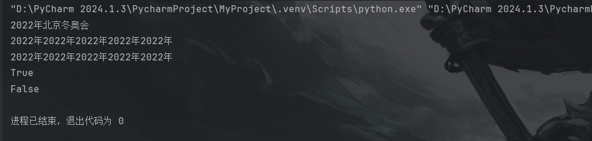

# 保留字与标识符

保留字指在Python中被赋予特地意义的一些单词，在开发程序时，不可以把这些保留字作为变量、函数、类、模块和其他对象的名称来使用。

以下是Python中的保留字：

| and      | as     | assert | break  | class   | continue | def    |
| -------- | ------ | ------ | ------ | ------- | -------- | ------ |
| `del`    | `elif` | else   | except | finally | for      | from   |
| False    | global | if     | import | in      | is       | lambda |
| nonlocal | not    | None   | or     | pass    | raise    | return |
| try      | True   | while  | with   | yield   | await    | async  |

如何查询保留字？

```python
import keyword
print(keyword.kwlist)   # 获取保留字并打印
print(len(keyword.kwlist)) # 获取保留字的个数
```


## Python标识符的命名规则

1. 可以是字符(英文，中文)、下划线 "_" 和数字，并且第一个字符不能是数字。
2. 不能使用 Python 中的保留字。
3. 标识符严格区分大小写
4. 以下划线开头的标识符有特殊意义，一般应避免使用相似的标识符。
5. 允许使用中文作为标识符，但不建议使用。

## Python标识符的命名规范

1. 模块名尽量短小，并且全部使用小写字母，可以使用下划线分割多个字母。例如：`grame_main`。
2. 包名尽量短小，并且全部使用小写字母，不推荐使用下划线。例如：`com.python`,不推荐使用 `com_python`
3. 类名采用单词首字母大写形式(Pascal风格)。例如：`MyClass`
4. 模块内部的类采用 "_" + Pascal 风格的类名组成，例如：在`MyClass` 中的内部类 `_InnerMyClass`。
5. 函数、类的属性和方法的命名，全部使用小写字母，多个字母之间使用下划线分割。
6. 常量命名时采用全部大写字母，可以使用下划线。
7. 使用单下划线 "_" 开头的模块变量或函数是受保护的，在使用 "`form xxx import *`" 语句从模块导入时，这些模块变量或函数不能被导入。
8. 使用双下划线 "__" 开头的实例变量或方法是类私有的。
9. 以双下划线开头和结尾的是 Python 的专用表示。例如：`__init__()`表示初始化函数。

# Pascal风格

‌**[Pascal风格](https://www.baidu.com/s?sa=re_dqa_generate&wd=Pascal风格&rsv_pq=80c76b060004544c&oq=Pascal 风格&rsv_t=f42cG7imbJQh1SS5sxRmvgpUaOM4MQaA5bhxq1XfiVmdXfS2dGzW6KwskQW0yzD8DxeerAQ&tn=68018901_16_pg&ie=utf-8)**‌是一种命名规范，主要用于编程和软件开发中，特别是在C#等语言中。Pascal风格的命名规则是：当变量名和函数名称由两个或两个以上单词连接而成，构成一个唯一识别字时，采用这种命名法以增加变量和函数的可读性。具体规则如下：

1. ‌**单词之间的连接**‌：单词之间不以空格断开或使用连接号(-)、下划线(_)连接，而是紧密相连。
2. ‌**首字母大写**‌：每个单词的首字母都采用大写字母，例如：`FirstName`、`LastName`。这种命名格式被称为“Pascal命名法”，也被称为“大驼峰式命名法”(Upper Camel Case)，它是驼峰式大小写的子集。

Pascal风格是一种命名惯例，虽然并无绝对与强制的要求，但它被广泛采用以增加代码的可读性和一致性。在编程实践中，一旦选择了Pascal风格作为命名规则，就应保持在整个代码库中的一致性。此外，Pascal风格不仅适用于编程中的类名、函数名等标识符的命名，也广泛应用于其他需要清晰、易于理解的文本标识中，如品牌名、产品系列名等‌。

# 变量与常量

变量是保存和表示数据值的一种语法元素，可以简单的理解为是一种名字。

变量的语法结构：

​	变量名 = value

例:

​	luck_number = 8


从图中我们可以看出变量类似于，快递和取件码的关系。就是通过取件码找到对应的快递，变量也是一样的，通过变量名从内存中找到变量值。

## 变量的定义：

```python 
luck_number = 8 # 创建一个整形变量 luck_number，并为其赋值为 8
my_name = 'Lazy' # 字符串类型的变量
print('luck_number 的数据类型是：',type(luck_number))  # <class 'int'>
print(my_name,'的幸运数字是:',luck_number)

# Python 动态修改变量的数据类型， 通过赋不同的值，就可以直接修改
luck_number = 'beijing welcome you'
print('luck_number的数据类型是：',type(luck_number))   # <class 'str'>

#在 Python 中允许多个变量指向同一个值
no=number=1024 # no与number都指向了1024这个整数值
print(no,number)
print(id(no))   # id() 查看对象的内存地址的
print(id(number)) # no 和 number 都是一样的内存地址的
```

效果图：


## 变量命名应遵循以下几条规则

1. 变量名必须是一个有效的标识符
2. 变量名不能使用 Python 中的保留字
3. 慎用小写字母I(挨)和大写字母O
4. 应选择有意义的单词作为变量名

## 常量：

1. 常量就是在程序运行过程中，其值不允许改变的量。
2. 全部使用大写字母和下划线命名。

常量的定义：

```python
pi=3.1415926    # 定义了一个变量
PI=3.1415926    # 定义了一个常量
```

# 数值类型

**整数类型**表示的数值是没有小数部分的数值，包含正整数、负整数和0

| 进制种类 | 引导符号 | 描述                                               |
| -------- | -------- | -------------------------------------------------- |
| 十进制   | 无       | 默认情况，例如：365、786                           |
| 二进制   | `0b或0B` | 由字符0和1组成，例如：`0b10101，0B10101`           |
| 八进制   | `0o或0O` | 由字符0到7组成，例如：`0o763,0O765`                |
| 十六进制 | `0x或0X` | 由字符0到9，a到f或A到F组成，例如：`0x987A，0X987A` |

例：

```python
num=987 # 默认是十进制，表示整数
num2=0b10101 # 使用二进制表示整数
num3=0o756 # 使用八进制表示整数
num4=0x87ABF # 使用十六进制表示整数
print(num)
print(num2)
print(num3)
print(num4)
```

结果：


<span style="font-weight: bolder;font-size: 30px;color: blueviolet;">浮点数类型</span>表示带有小数的数值，由整数部分和小数部分组成

<span style="font-weight: bolder;font-size: 20px;color: blueviolet;">注意事项:</span>

两个浮点类型的数在进行运算时，有一定的概率运算结果后增加一些"<span style=" font-weight: bolder;font-size: 20px;color: blueviolet;">不确定的</span>"尾数

Python中的<span style=" font-weight: bolder;color: blueviolet;">负数</span>与数学中的复数形式完全一致，由<span style=" font-weight: bolder;color: blueviolet;">实部</span>和<span style=" font-weight: bolder;color: blueviolet;">虚部</span>组成
$$
j=\sqrt{-1}
$$
在Python中<span style=" font-weight: bolder;color: blueviolet;">实数</span>部分使用<span style=" font-weight: bolder;color: blueviolet;">.real</span>,<span style=" font-weight: bolder;color: blueviolet;">虚数</span>部分使用<span style=" font-weight: bolder;color: blueviolet;">.imag</span>表示

例：

```python
height=187.6 # 身高
print(height)
print(type(height)) # type() 查看 height 这个变量的数据类型

x=10
y=10.0
print('x的数据类型:',type(x)) # int
print('y的数据类型:',type(y)) # float

x=1.99E1413
print('科学计数法:',x,'x的数据类型',type(x))
print(0.1+0.2) # 不确定的尾数问题 0.30000000000000004

print(round(0.1+0.2,1)) # 0.3
```

结果：


复数的类型：

复数的类型由实数部分和虚数部分组成

例：

```python
x=123+456j
print('实数部分：',x.real)
print('虚数部分：',x.imag)
```

结果：


# 字符串类型

<span style="font-weight: bolder;font-size: 30px;color: blueviolet;">字符串类型</span>连续的字符序列，可以表示计算机所能识别的一切字符。

<span style="font-weight: bolder;font-size: 20px;color: blueviolet;">字符串的界定符：</span>单引号、双引号，三引号

| 转义字符 | 描述说明                             |
| -------- | ------------------------------------ |
| \n       | 换行符                               |
| \t       | 水平制表位，用于横向跳到下一个制表位 |
| \\"      | 双引号                               |
| \\'      | 单引号                               |
| \\\      | 一个反斜杠                           |

<span style="font-weight: bolder;font-size: 20px;color: blueviolet;">原字符：</span>使转义字符失效的字符，r或R

**字符串类型与整数类型还有浮点数类型都是Python中的不可变数据类型。**

```python
city='天津'
address='天津市宝坻区香江大街3号'
print(city)
print(address)
# 多行字符串
info='''地址：天津市宝坻区香江大街3号
    收件人：xxx
    手机号：139xxxxxxxx
        '''
info2="""地址：天津市宝坻区香江大街3号
    收件人：xxx
    手机号：139xxxxxxxx
        """
print(info)
print("-----------------------")
print(info2)
```


转义字符例：

```python
print('北京')
print('欢迎你')
print('-------------')
print('北京\n欢迎你') # 遇到\n即换行，可以连续换多行
print('北\n京\n欢\n迎\n你')
print('----------')
print('北京北京\t欢迎你')
print('hello\toooo') # hello 是5个字符，一个制表位是8个字符 8-5=3
print('hellooooo')
print('老师说:\'好好学习，天天向上\'')
print('老师说:\"好好学习，天天向上\"')

# 原字符，使转义字符失效的符号 r 或 R
print(r'北\n京\n欢\n迎\n你')
print(R'北\n京\n欢\n迎\n你')
```


<span style="font-weight: bolder;font-size: 20px;color: blueviolet;">字符串</span>又被称为<span style="font-weight: bolder;font-size: 20px;color: blueviolet;">有序的</span>字符序列，对字符串中某个字符的<span style="font-weight: bolder;font-size: 20px;color: blueviolet;">检索</span>称为<span style="font-weight: bolder;font-size: 20px;color: blueviolet;">索引</span>


切片：

对字符中摸个<span style="font-weight: bolder;font-size: 20px;color: blueviolet;">子串</span>或<span style="font-weight: bolder;font-size: 20px;color: blueviolet;">区间</span>的检索称为<span style="font-weight: bolder;font-size: 20px;color: blueviolet;">切片</span>

<span style="font-weight: bolder;font-size: 20px;color: blueviolet;">切片的语法结构：</span>

字符串或字符串变量[N:M]


例：

```python
#字符串的索引
s='HELLOWORLD'
print(s[0],s[-10])  # 序号0和序号-10表示的是同一个字符
print('北京欢迎你'[4])   # 获取字符串中索引为4
print('北京欢迎你'[-1])
print('---------------------')
# 字符串的切片
print(s[2:7]) # 从2开始到7结束不包含7    正向递增
print(s[-8:-3]) # 反向递减
print(s[:5]) # 默认从 0 开始，到5结束，不包含5
print(s[5:]) # 默认切到字符串的结尾
```


常用的字符串操作

| 操作符    | 描述说明                                    |
| --------- | ------------------------------------------- |
| x+y       | 将字符串x与y连接起来                        |
| x*n或n\*x | 复制n次字符串x                              |
| x in s    | 如果x是s的子串，结果为True，否则结果为False |

例：

```python
x='2022年'
y='北京冬奥会'
print(x+y) # 连接两个字符串
print(x*5) # 对x这个字符串的内容复制5次
print(5*x)

print('北京' in y) # True
print('上海' in y) # false
```


# 布尔类型

用来表示 “<span style="color:#733EA6;font-weight: bolder;font-size:20px;">真</span>”值或"<span style="color:#733EA6;font-weight: bolder;font-size:20px;">假</span>"值的数据类型。

在Python中使用标识符"<span style="color:#733EA6;font-weight: bolder;font-size:20px;">True</span>"或"<span style="color:#733EA6;font-weight: bolder;font-size:20px;">False</span>"表示布尔类型的值"<span style="color:#733EA6;font-weight: bolder;font-size:20px;">True</span>"表示整数<span style="color:#733EA6;font-weight: bolder;font-size:20px;">1</span>,<span style="color:#733EA6;font-weight: bolder;font-size:20px;">False</span>表示整数<span style="color:#733EA6;font-weight: bolder;font-size:20px;">0</span>

<span style="color:#733EA6;font-weight: bolder;font-size:20px;">布尔值为False的情况如下：</span>

- False 或者是 None
- 数值中的 0，包含0,0.0，虚数0
- 空序列，包含空字符串，空元祖，空列表，空字典，空集合
- 自定义对象的实例，该对象的`_bool_()`方法返回`Flase`或`_len_()`方法返回 0

例：

```python
x=True
y=False
print(type(x))
print(type(y))
print("x的值",x+10)
print("y的值",y+10)
```


测试对象的布尔值：

```python
print(bool(18))
print(bool(0),bool(0.1))
print(bool(''))
print(bool("111"))
print(bool(False))
print(bool(None))xxxxxxxxxx7 1print(bool(18))2print(bool(0),bool(0.1))3print(bool(''))4print(bool("111"))5print(bool(False))6print(bool(None))print(bool(18))7print(bool(0),bool(0.1))
```


总结：

1. 数字
   1. 非0的布尔值为 True
   2. 负数的布尔值为 False
2. 字符串
   1. 空串的布尔值为 False
   2. 所有非空字符串的布尔值为 True
3. None 的布尔值为 False
4. False 的布尔值为 False

# 数据类型之间的转换

类型转换：

1. 隐式转换
2. 显式转换

| 函数     | 描述说明                            |
| -------- | ----------------------------------- |
| int(x)   | 将x转换成整数类型                   |
| float(x) | 将x转换为浮点数类型                 |
| `str(x)` | 将x转成字符串                       |
| `chr(x)` | 将整数x转换为一个字符               |
| `ord(x)` | 将一个字符x转换为其对应的值         |
| `hex(x)` | 将一个整数x转换为一个十六进制字符串 |
| `oct(x)` | 将一个整数x转换为一个八进制的字符串 |
| `bin(x)` | 将一个整数x转换为一个二进制的字符串 |

例：

```python
x=10
y=3
z=x/y # 隐式转换，通过运算符隐式的转了结果的类型
print(z,type(z))

# float 转成 int 类型，只保留整数部分
print('float类型转成int类型',float(z))

# 将int转成 float类型
print('int类型转成float类型',float(3))
# 将 str 转成 int 类型
print('str类型转成int类型',int('314'))
# 将字符串转成int或float时报错的情况
# print(int('19a')) # a 不是十进制的数 error
# print(float('3.1a')) # a不是float类型的数 error
# chr() ord() 互为相反操作
print('1在unicode所对应的值是：',ord('1')) # 1在Unicode表中所对应的值
print('134在unicode所对应的字符是',chr(134)) # 134整数在unicode表中所对应的字符是什么

# 进制之间的转换操作
print('十进制转成16进制：',hex(100))
print('十进制转成八进制：',oct(100))
print('十进制转成二进制：',bin(100))
```


# `eval`函数

1. Python中的内置函数
2. 用于去掉字符串最外侧的引号，并按照Python语句方式执行去掉引号后的字符
3. `eval()`函数经常和input()函数一起使用

`eval`的语法格式

```python
变量=eval(字符串)
```

例：

```python
x='3.14+3'
print(x,type(x))
x=eval(x) # 使用 eval函数去掉单引号，改变了数据类型，执行了运算符
print(x,type(x))

# eval 函数经常与 input函数一起使用，用来获取用户输入的数据
age=eval(input('请输入您的年龄：'))
print(age,type(age))
height=eval(input('请输入您的身高：'))
print(height,type(height))
hello='zs'
print(eval('hello')) # 输出了 zs
print(eval('zs')) # error
```


# 算术运算符

<font color=#733EA6 size=5px fontWeight=bolder>算术运算符</font>:用于处理四则运算的符号

| <font color=#FF000F>运算符</font> | <font color=#FF000F>描述说明</font> | <font color=#FF000F>示例</font> | <font color=#FF000F>结果</font> |
| --------------------------------- | ----------------------------------- | :-----------------------------: | ------------------------------- |
| +                                 | 加法                                |               1+1               | 2                               |
| -                                 | 减法                                |               1-1               | 0                               |
| *                                 | 乘法                                |               2*3               | 6                               |
| /                                 | 除法                                |              10/2               | 5.0                             |
| //                                | 整除                                |              10//3              | 3                               |
| %                                 | 取余                                |              10%3               | 1                               |
| **                                | 幂运算                              |              2**4               | 16                              |

例：

```python
print('加法：',1+1)
print('减法：',1-1)
print('乘法：',2*3)
print('除法(结果为浮点类型的数)：',10/3)
print('整除：',10//3)
print('取余：',10%3)
print('幂运算：',2**4)
```


10/0等于多少？让我来用Python试试！

```python
print(10/0)
```


报错了，`divsion by zero`除零异常，在<font color=red>Python中我们的零不可以用来做被除数</font>

## 算术运算符的优先级

第一级：**

第二级：*、/、%、//

第三级：+、-

# 赋值运算符

| <font color=red>运算符</font> | <font color=red>描述说明</font> | <font color=red>示例</font> | <font color=red>展开形式</font> |
| :---------------------------: | ------------------------------- | --------------------------- | :-----------------------------: |
|               =               | 简单的赋值运算                  | x=y                         |               x=y               |
|              +=               | 加赋值                          | x+=y                        |              x=x+y              |
|              -=               | 减赋值                          | x-=y                        |              x=x-y              |
|              *=               | 乘赋值                          | x*=y                        |              x=x*y              |
|              /=               | 除赋值                          | x/=y                        |              x=x/y              |
|              %=               | 取余赋值                        | x%=y                        |              x=x%y              |
|              **=              | 幂赋值                          | x**=y                       |             x=x**y              |
|              //=              | 整除赋值                        | x//=y                       |             x=x//y              |

示例：

```python
x=20
y=10
x+=y # 将x+y的值，赋值给 x
print('x的值是：',x)
x-=y # 将x-y的值，赋值给 x
print('x的值是：',x)
x*=y # 将x*y的值，赋值给 x
print('x的值是：',x)
x/=y #将x/y的值，赋值给 x, x的值发生了类型转换，x的值为 float
print('x的值是：',x,'x的类型是：',type(x))
x%=y #将x%y的值，赋值给 x,取余
print('x的值是：',x)
z=3
y//=2 # 整除，将2整除y的值，赋值给 y
print('y的值是：',y)
y**2 # y的二次幂，在赋值给 y
print('y的值是：',y)
```


Python支持链式赋值

```python
a=b=c=100 # 相当于给 a、b、c同时赋值100
```

Python支持系列解包赋值

```python
a,b=10,20  # 相当于执行了 a=10,b=20
```

利用系列解包赋值交换两个变量的值

```python
a,b=b,a # 将b的值赋值给a,a的值赋值给b
```

# 比较运算符(关系运算符)

| <font color=red>运算符</font> | <font color=red>描述说明</font> | <font color=red>示例</font> | <font color=red>展示形式</font> |
| ----------------------------- | ------------------------------- | --------------------------- | ------------------------------- |
| >                             | 大于                            | 98>90                       | True                            |
| <                             | 小于                            | 98<90                       | False                           |
| ==                            | 等于                            | 98==90                      | False                           |
| !=                            | 不等于                          | 98!=90                      | True                            |
| >=                            | 大于或等于                      | 98>=98                      | True                            |
| <=                            | 小于或等于                      | 98<=98                      | True                            |

示例：
```python
print('98大于90吗？',98>90)
print('98小于90吗？',98<90)
print('98等于90吗？',98==90)
print('98不等于90吗？',98!=90)
print('98大于等于98吗？',98>=98)
print('98小于等于98吗？',98<=98)
```


# 逻辑运算符

| <font color=red>运算符</font> | <font color=red>描述说明</font> | <font color=red>用法</font> | <font color=red>结合方向</font> |
| ----------------------------- | ------------------------------- | --------------------------- | ------------------------------- |
| and                           | 逻辑与                          | 表达式1 and 表达式2         | 从左到右                        |
| or                            | 逻辑或                          | 表达式1 or 表达式2          | 从左到右                        |
| not                           | 逻辑非                          | not 表达式                  | 从右到左                        |

| 表达式1 | 表达式2 | 表达式1 and 表达式2 | 表达式1 or 表达式2 | not 表达式1 |
| :------ | :-----: | :-----------------: | :----------------: | ----------- |
| True    |  True   |        True         |        True        | False       |
| True    |  False  |        False        |        True        | True        |
| False   |  False  |        False        |       False        | True        |
| False   |  True   |        False        |        True        | True        |

示例：

```python
print(True and True)
print(True and True)
print(False and False)
print(False and True)

print('-'*40)

print(8>7 and 6>5)
print(8>7 and 6<5)
print(8<7 and 10/0) # 8<7 为 False，and 当第一个表达式结果为 False，直接出结果

print('-'*40)
print(True or True)
print(True or False)
print(False or False)
print(False or True)
print('-'*40)

print(8>7 or 10/0) # True，or 当左侧表达式结果为 True 时，右侧表达式不会被执行

print('-'*40)
print(not True)
print(not False)
print(not(8>7))
```


# 位运算符

<font color=#733EA6 size=5px>位运算符</font>把数字当作二进制数来进行计算的

<font color=#733EA6 size=5px>按 "位" 与运算(&)</font>


<font color=#733EA6 size=5px>按 "或" 与运算(|)</font>


更多位运算符请参考 
[运算基础](https://mac2git.github.io/docs-demo/doc-text/emu/emu01.html#%E4%B8%8E%E6%88%96%E5%BC%82%E6%88%96%E9%9D%9E%E8%BF%90%E7%AE%97)


# 运算符的优先级

| <font color=red>运算符</font> | <font color=red>描述说明</font> |
| ----------------------------- | ------------------------------- |
| ()                            | 括号                            |
| **                            | 幂运算                          |
| ~、+、-                       | 取反、正号、负号                |
| *、/、%、//                   | 算术运算符                      |
| +、-                          | 算术运算符                      |
| <<、>>                        | 位运算符中的左移位和右移位      |
| &                             | 位运算符中的按位与              |
| ^                             | 位运算符中的异或                |
| \|                            | 位运算符在的按位或              |
| <、<=、>、>=、!=、==          | 比较运算符                      |

# 总结：

:warning:保留字是 Python 已经被赋予特定意义的一些单词，保留字严格区分大小写。

:warning:标识符可用来给变量、函数、类、模块和其他对象命名。

:warning:标识符的命名规则：

1. 可以是字母(包含中文)、数字、下划线、第一个字符不能是数字
2. 不能是 Python 中的保留字
3. 标识符严格区分大小写
4. 以下划线开头的标识符有特殊意义，不能随便使用
5. 允许使用中文作为标识符，但不建议使用

:warning:变量的语法结构：

1. 变量名 = value

:warning:整数类型有四种表示形式：二进制、八进制、十进制、十六进制。

:warning:浮点数可以使用内置函数 round() 限定运算结果需要保留的小数位数。

:warning:字符串又称为不可变字符序列，可根据索引检索元素，也可根据索引进行切片操作。

:warning:布尔类型有两种取值 True 和 False。

:warning:常用的数据类型转换函数为 int()、float() 和 str()

:warning:内置函数 eval() 可拼接字符串转换成真实的数据类型

:warning:算术运算符：+、-、*、/、//、%、**

:warning:赋值运算符：= 、 += 、-= 、*= 、 /=、//= 、%=、**=

:warning:比较运算符：>、>=、<、<=、==、!=

:warning:逻辑运算符：and、or、not

:warning:位运算符：&、|、^、~、<<、>>
