# 保留字与标识符

保留字指在Python中被赋予特地意义的一些单词，在开发程序时，不可以把这些保留字作为变量、函数、类、模块和其他对象的名称来使用。

以下是Python中的保留字：

| and      | as     | assert | break  | class   | continue | def    |
| -------- | ------ | ------ | ------ | ------- | -------- | ------ |
| `del`    | `elif` | else   | except | finally | for      | from   |
| False    | global | if     | import | in      | is       | lambda |
| nonlocal | not    | None   | or     | pass    | raise    | return |
| try      | True   | while  | with   | yield   | await    | async  |

如何查询保留字？

```python
import keyword
print(keyword.kwlist)   # 获取保留字并打印
print(len(keyword.kwlist)) # 获取保留字的个数
```

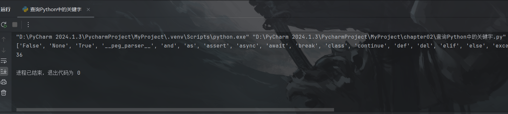

## Python标识符的命名规则

1. 可以是字符(英文，中文)、下划线 "_" 和数字，并且第一个字符不能是数字。
2. 不能使用 Python 中的保留字。
3. 标识符严格区分大小写
4. 以下划线开头的标识符有特殊意义，一般应避免使用相似的标识符。
5. 允许使用中文作为标识符，但不建议使用。

## Python标识符的命名规范

1. 模块名尽量短小，并且全部使用小写字母，可以使用下划线分割多个字母。例如：`grame_main`。
2. 包名尽量短小，并且全部使用小写字母，不推荐使用下划线。例如：`com.python`,不推荐使用 `com_python`
3. 类名采用单词首字母大写形式(Pascal风格)。例如：`MyClass`
4. 模块内部的类采用 "_" + Pascal 风格的类名组成，例如：在`MyClass` 中的内部类 `_InnerMyClass`。
5. 函数、类的属性和方法的命名，全部使用小写字母，多个字母之间使用下划线分割。
6. 常量命名时采用全部大写字母，可以使用下划线。
7. 使用单下划线 "_" 开头的模块变量或函数是受保护的，在使用 "`form xxx import *`" 语句从模块导入时，这些模块变量或函数不能被导入。
8. 使用双下划线 "__" 开头的实例变量或方法是类私有的。
9. 以双下划线开头和结尾的是 Python 的专用表示。例如：`__init__()`表示初始化函数。

# Pascal风格

‌**[Pascal风格](https://www.baidu.com/s?sa=re_dqa_generate&wd=Pascal风格&rsv_pq=80c76b060004544c&oq=Pascal 风格&rsv_t=f42cG7imbJQh1SS5sxRmvgpUaOM4MQaA5bhxq1XfiVmdXfS2dGzW6KwskQW0yzD8DxeerAQ&tn=68018901_16_pg&ie=utf-8)**‌是一种命名规范，主要用于编程和软件开发中，特别是在C#等语言中。Pascal风格的命名规则是：当变量名和函数名称由两个或两个以上单词连接而成，构成一个唯一识别字时，采用这种命名法以增加变量和函数的可读性。具体规则如下：

1. ‌**单词之间的连接**‌：单词之间不以空格断开或使用连接号(-)、下划线(_)连接，而是紧密相连。
2. ‌**首字母大写**‌：每个单词的首字母都采用大写字母，例如：`FirstName`、`LastName`。这种命名格式被称为“Pascal命名法”，也被称为“大驼峰式命名法”(Upper Camel Case)，它是驼峰式大小写的子集。

Pascal风格是一种命名惯例，虽然并无绝对与强制的要求，但它被广泛采用以增加代码的可读性和一致性。在编程实践中，一旦选择了Pascal风格作为命名规则，就应保持在整个代码库中的一致性。此外，Pascal风格不仅适用于编程中的类名、函数名等标识符的命名，也广泛应用于其他需要清晰、易于理解的文本标识中，如品牌名、产品系列名等‌。

# 变量与常量

变量是保存和表示数据值的一种语法元素，可以简单的理解为是一种名字。

变量的语法结构：

​	变量名 = value

例:

​	luck_number = 8

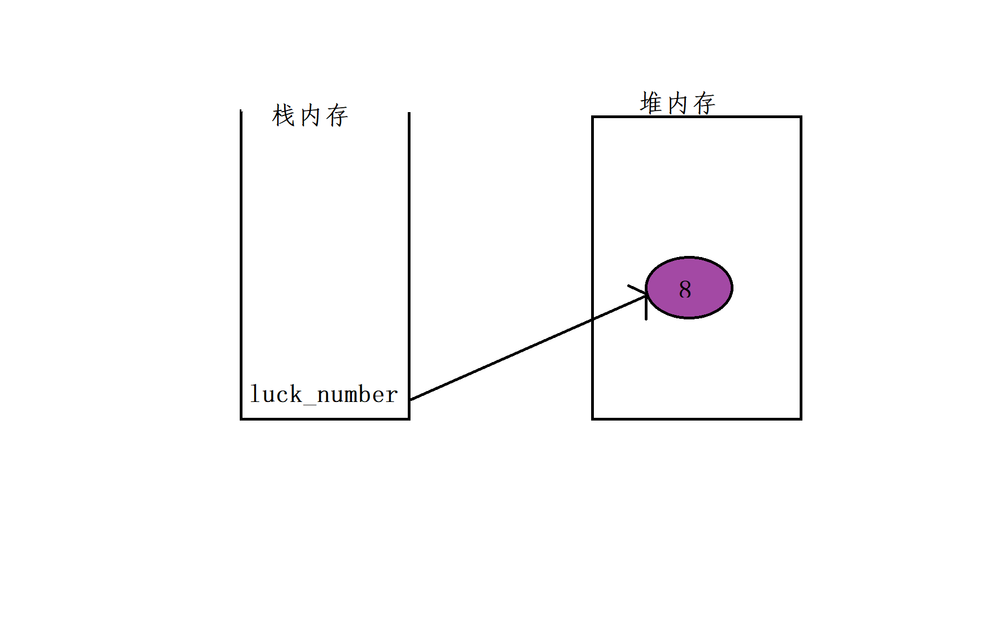

从图中我们可以看出变量类似于，快递和取件码的关系。就是通过取件码找到对应的快递，变量也是一样的，通过变量名从内存中找到变量值。

## 变量的定义：

```python 
luck_number = 8 # 创建一个整形变量 luck_number，并为其赋值为 8
my_name = 'Lazy' # 字符串类型的变量
print('luck_number 的数据类型是：',type(luck_number))  # <class 'int'>
print(my_name,'的幸运数字是:',luck_number)

# Python 动态修改变量的数据类型， 通过赋不同的值，就可以直接修改
luck_number = 'beijing welcome you'
print('luck_number的数据类型是：',type(luck_number))   # <class 'str'>

#在 Python 中允许多个变量指向同一个值
no=number=1024 # no与number都指向了1024这个整数值
print(no,number)
print(id(no))   # id() 查看对象的内存地址的
print(id(number)) # no 和 number 都是一样的内存地址的
```

效果图：

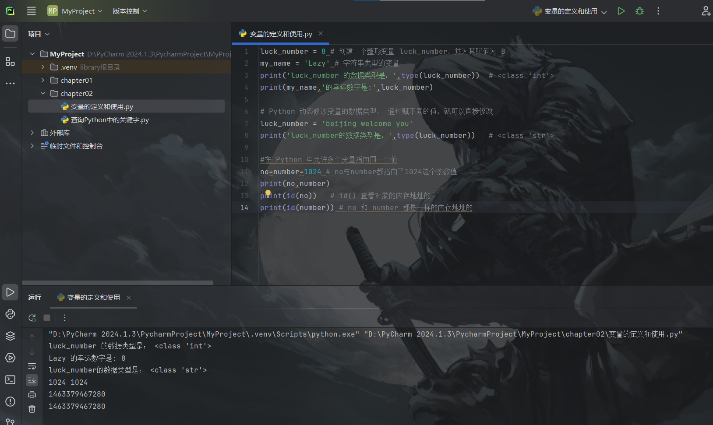

## 变量命名应遵循以下几条规则

1. 变量名必须是一个有效的标识符
2. 变量名不能使用 Python 中的保留字
3. 慎用小写字母I(挨)和大写字母O
4. 应选择有意义的单词作为变量名

## 常量：

1. 常量就是在程序运行过程中，其值不允许改变的量。
2. 全部使用大写字母和下划线命名。

常量的定义：

```python
pi=3.1415926    # 定义了一个变量
PI=3.1415926    # 定义了一个常量
```

# 数值类型

**整数类型**表示的数值是没有小数部分的数值，包含正整数、负整数和0

| 进制种类 | 引导符号 | 描述                                               |
| -------- | -------- | -------------------------------------------------- |
| 十进制   | 无       | 默认情况，例如：365、786                           |
| 二进制   | `0b或0B` | 由字符0和1组成，例如：`0b10101，0B10101`           |
| 八进制   | `0o或0O` | 由字符0到7组成，例如：`0o763,0O765`                |
| 十六进制 | `0x或0X` | 由字符0到9，a到f或A到F组成，例如：`0x987A，0X987A` |

例：

```python
num=987 # 默认是十进制，表示整数
num2=0b10101 # 使用二进制表示整数
num3=0o756 # 使用八进制表示整数
num4=0x87ABF # 使用十六进制表示整数
print(num)
print(num2)
print(num3)
print(num4)
```

结果：

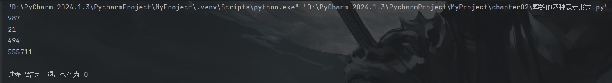

<span style="font-weight: bolder;font-size: 30px;color: blueviolet;">浮点数类型</span>表示带有小数的数值，由整数部分和小数部分组成

<span style="font-weight: bolder;font-size: 20px;color: blueviolet;">注意事项:</span>

两个浮点类型的数在进行运算时，有一定的概率运算结果后增加一些"<span style=" font-weight: bolder;font-size: 20px;color: blueviolet;">不确定的</span>"尾数

Python中的<span style=" font-weight: bolder;color: blueviolet;">负数</span>与数学中的复数形式完全一致，由<span style=" font-weight: bolder;color: blueviolet;">实部</span>和<span style=" font-weight: bolder;color: blueviolet;">虚部</span>组成
$$
j=\sqrt{-1}
$$
在Python中<span style=" font-weight: bolder;color: blueviolet;">实数</span>部分使用<span style=" font-weight: bolder;color: blueviolet;">.real</span>,<span style=" font-weight: bolder;color: blueviolet;">虚数</span>部分使用<span style=" font-weight: bolder;color: blueviolet;">.imag</span>表示

例：

```python
height=187.6 # 身高
print(height)
print(type(height)) # type() 查看 height 这个变量的数据类型

x=10
y=10.0
print('x的数据类型:',type(x)) # int
print('y的数据类型:',type(y)) # float

x=1.99E1413
print('科学计数法:',x,'x的数据类型',type(x))
print(0.1+0.2) # 不确定的尾数问题 0.30000000000000004

print(round(0.1+0.2,1)) # 0.3
```

结果：

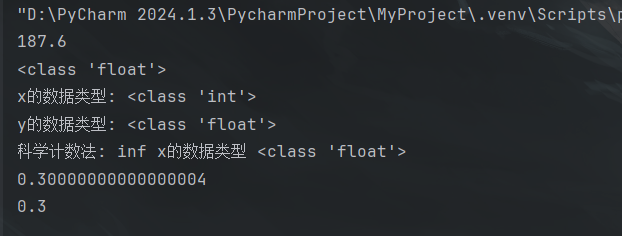

复数的类型：

复数的类型由实数部分和虚数部分组成

例：

```python
x=123+456j
print('实数部分：',x.real)
print('虚数部分：',x.imag)
```

结果：

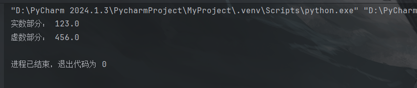

# 字符串类型

<span style="font-weight: bolder;font-size: 30px;color: blueviolet;">字符串类型</span>连续的字符序列，可以表示计算机所能识别的一切字符。

<span style="font-weight: bolder;font-size: 20px;color: blueviolet;">字符串的界定符：</span>单引号、双引号，三引号

| 转义字符 | 描述说明                             |
| -------- | ------------------------------------ |
| \n       | 换行符                               |
| \t       | 水平制表位，用于横向跳到下一个制表位 |
| \\"      | 双引号                               |
| \\'      | 单引号                               |
| \\\      | 一个反斜杠                           |

<span style="font-weight: bolder;font-size: 20px;color: blueviolet;">原字符：</span>使转义字符失效的字符，r或R

**字符串类型与整数类型还有浮点数类型都是Python中的不可变数据类型。**

```python
city='天津'
address='天津市宝坻区香江大街3号'
print(city)
print(address)
# 多行字符串
info='''地址：天津市宝坻区香江大街3号
    收件人：xxx
    手机号：139xxxxxxxx
        '''
info2="""地址：天津市宝坻区香江大街3号
    收件人：xxx
    手机号：139xxxxxxxx
        """
print(info)
print("-----------------------")
print(info2)
```

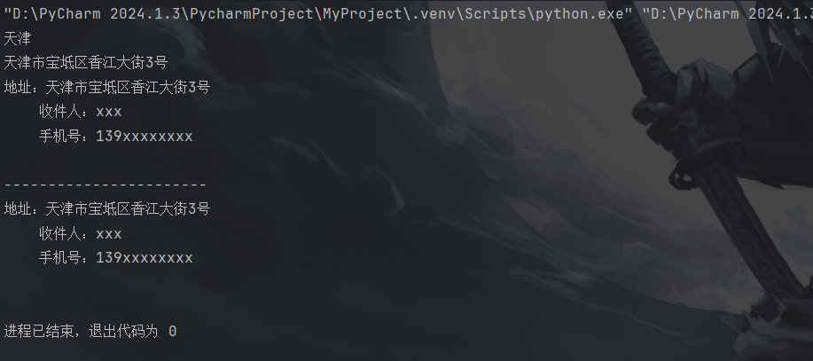

转义字符例：

```python
print('北京')
print('欢迎你')
print('-------------')
print('北京\n欢迎你') # 遇到\n即换行，可以连续换多行
print('北\n京\n欢\n迎\n你')
print('----------')
print('北京北京\t欢迎你')
print('hello\toooo') # hello 是5个字符，一个制表位是8个字符 8-5=3
print('hellooooo')
print('老师说:\'好好学习，天天向上\'')
print('老师说:\"好好学习，天天向上\"')

# 原字符，使转义字符失效的符号 r 或 R
print(r'北\n京\n欢\n迎\n你')
print(R'北\n京\n欢\n迎\n你')
```

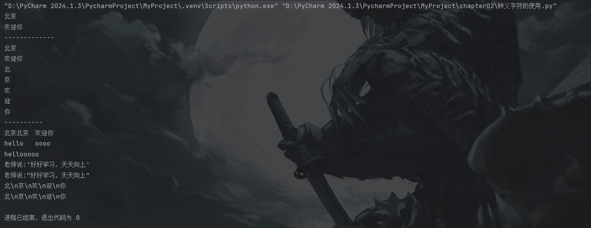

<span style="font-weight: bolder;font-size: 20px;color: blueviolet;">字符串</span>又被称为<span style="font-weight: bolder;font-size: 20px;color: blueviolet;">有序的</span>字符序列，对字符串中某个字符的<span style="font-weight: bolder;font-size: 20px;color: blueviolet;">检索</span>称为<span style="font-weight: bolder;font-size: 20px;color: blueviolet;">索引</span>

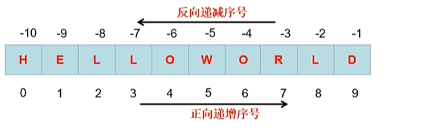

切片：

对字符中摸个<span style="font-weight: bolder;font-size: 20px;color: blueviolet;">子串</span>或<span style="font-weight: bolder;font-size: 20px;color: blueviolet;">区间</span>的检索称为<span style="font-weight: bolder;font-size: 20px;color: blueviolet;">切片</span>

<span style="font-weight: bolder;font-size: 20px;color: blueviolet;">切片的语法结构：</span>

字符串或字符串变量[N:M]

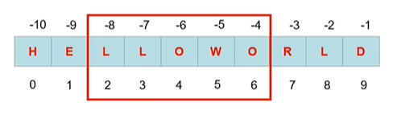

例：

```python
#字符串的索引
s='HELLOWORLD'
print(s[0],s[-10])  # 序号0和序号-10表示的是同一个字符
print('北京欢迎你'[4])   # 获取字符串中索引为4
print('北京欢迎你'[-1])
print('---------------------')
# 字符串的切片
print(s[2:7]) # 从2开始到7结束不包含7    正向递增
print(s[-8:-3]) # 反向递减
print(s[:5]) # 默认从 0 开始，到5结束，不包含5
print(s[5:]) # 默认切到字符串的结尾
```

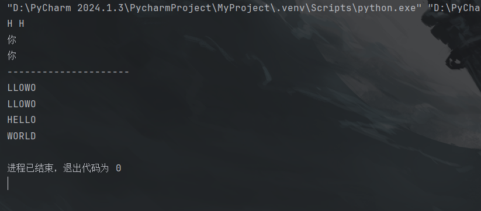

常用的字符串操作

| 操作符    | 描述说明                                    |
| --------- | ------------------------------------------- |
| x+y       | 将字符串x与y连接起来                        |
| x*n或n\*x | 复制n次字符串x                              |
| x in s    | 如果x是s的子串，结果为True，否则结果为False |

例：

```python
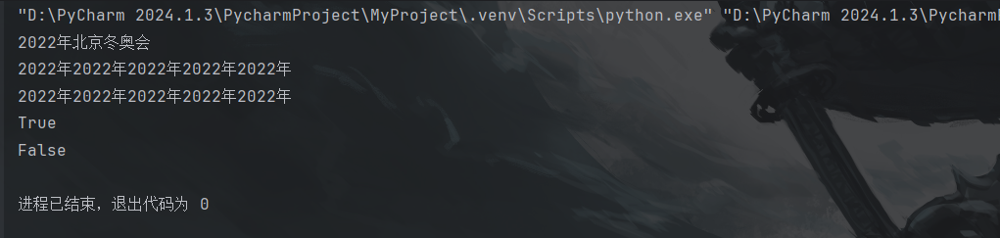x='2022年'
y='北京冬奥会'
print(x+y) # 连接两个字符串
print(x*5) # 对x这个字符串的内容复制5次
print(5*x)

print('北京' in y) # True
print('上海' in y) # false
```


